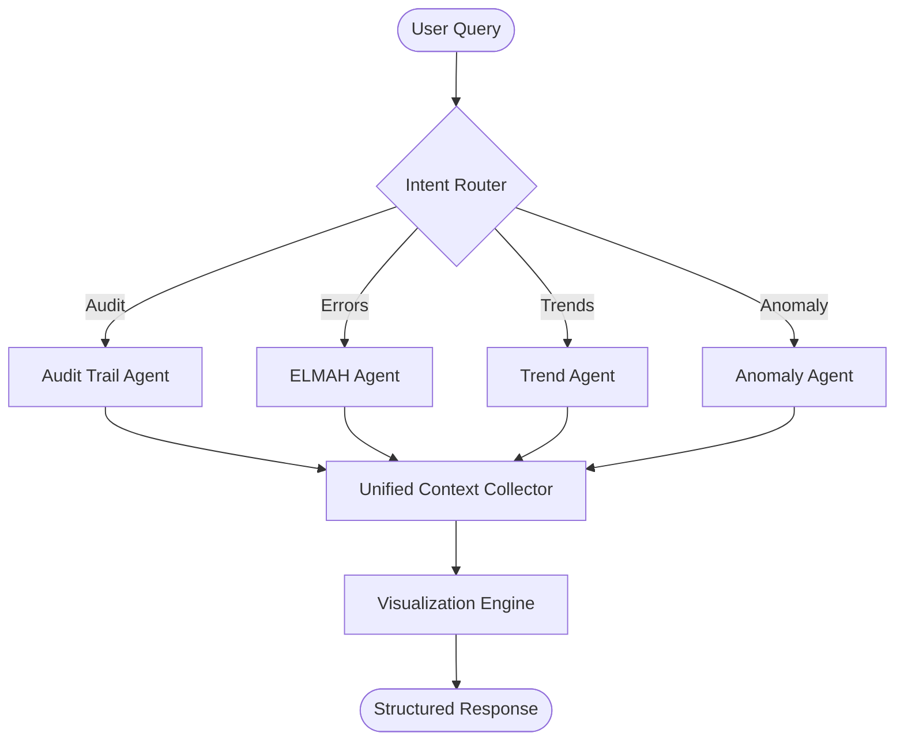

# StaffConnect: Multi-Agent SQL Analytics Pipeline (LangGraph + Oracle)

A professional-grade, agentic blueprint for enterprise-level **Text-to-SQL** analytics. This system uses **LangGraph** to orchestrate specialized LLM agents that generate safe SQL, query an Oracle database, run higher-level analytics (trends/anomalies), and return a **structured response** with optional **matplotlib visualizations**.

> **Who this is for**
- AI Engineers building **agentic analytics** over enterprise databases
- Data/Platform teams that want a modular Text-to-SQL stack with guardrails
- Anyone who wants a clean reference architecture for **Router → Experts → Aggregation → Visualization**

---

## Table of Contents
- [Key Concepts](#key-concepts)
- [High-Level Architecture](#high-level-architecture)
- [Repository Layout](#repository-layout)
- [Execution Flow: What Happens on a Query](#execution-flow-what-happens-on-a-query)
- [Agents](#agents)
- [State Model](#state-model)
- [SQL Safety & Guardrails](#sql-safety--guardrails)
- [Visualization & Output Contracts](#visualization--output-contracts)
- [Configuration](#configuration)
- [Local Setup](#local-setup)
- [Running the App](#running-the-app)
- [Testing](#testing)
- [Docker](#docker)
- [Examples](#examples)
- [Extending the System](#extending-the-system)
- [Troubleshooting](#troubleshooting)
- [Contributing](#contributing)
- [License](#license)

---

## Key Concepts

### Router-Expert Pattern
The system uses a **Router** to classify user intent and dispatch the query to one specialized **Expert Agent** (or sometimes multiple, depending on your graph design). Each expert is optimized for a particular domain:
- Audit trail / activity logs
- Error log analysis (ELMAH-style)
- Trends / time-series analytics
- Anomaly detection

### LangGraph as the Orchestrator
LangGraph models the workflow as a **state machine**:
- Each node reads/writes to a shared `AgentState`
- Conditional edges route to the right expert agent
- You can add loops (repair/refine) when SQL fails or outputs are incomplete

---

## High-Level Architecture



## Repository Layout
Top-level folders and files in this repo: 

```text
.github/                  # CI workflows and repo automation
blueprints/               # Reusable LangGraph blueprints / templates
docs/                     # Documentation notes / design references
examples/                 # Example queries, scripts, or sample runs
pipelines/                # Core agent graph(s) + agent implementations
tests/                    # Unit/integration tests
utils/pipelines/          # Shared pipeline utilities (SQL helpers, viz, etc.)

config.py                 # Central configuration loader (env, flags)
schemas.py                # Pydantic / typed schemas used across agents
main.py                   # Entry point (build graph, run loop / server)
docker-compose.yaml       # Container orchestration
Dockerfile                # Container build
env.example               # Example env vars
dev.sh / start.sh         # Convenience scripts
CONTRIBUTING.md           # Contribution guide
LICENSE                   # MIT license
```

### Where to start reading the code
If you’re new to the codebase, read in this order:

1. `main.py` → app entry, graph build, execution loop 
2. `pipelines/` → router + agent nodes + graph wiring 
3. `schemas.py` → state + response contracts 
4. `utils/pipelines/` → SQL cleaning, execution, chart creation 
5. `tests/` → what “correct behavior” means 

---

## Execution Flow: What Happens on a Query
This is the conceptual runtime pipeline (matches the repo’s structure and file responsibilities):

1. **User query enters the system** (CLI loop or API layer in `main.py`).
2. **State is initialized** (`AgentState`) with:
    - raw user input
    - conversation history (optional)
    - db connection settings / handles (optional)
3. **Router node runs**:
    - classifies intent (audit/errors/trends/anomaly/general sql)
    - writes `state.route = <agent_name>`
4. **Expert agent runs**:
    - loads schema context (tables/columns) as needed
    - generates SQL or analysis plan
    - executes SQL safely
    - returns structured data + explanation
5. **Collector node aggregates**:
    - normalizes outputs into one common contract
    - attaches metadata (timing, rows returned, warnings)
6. **Visualization node optionally runs**:
    - if agent output requests a plot (or data looks plottable)
    - creates chart images / base64 payload (implementation-dependent)
7. **Final formatter returns**:
    - human-readable answer
    - machine-readable JSON payload
    - optional chart payload

---

## Agents
Your README describes 4 core experts; this repo’s folder layout supports that modular design. 

### 1) Audit Trail Agent
**Intent**: audit/activity investigation
Typical outputs:
- top events by user/action/time window
- suspicious access patterns
- drill-down by entity IDs

### 2) ELMAH Agent
**Intent**: error logs / failures / stack traces
Typical outputs:
- error frequency trends
- top exception types + root cause hints
- correlation with deployments/time windows

### 3) Trend Agent
**Intent**: time-series / KPI style analytics
Typical outputs:
- daily/weekly aggregation
- moving averages
- seasonality hints
- plot-ready series

### 4) Anomaly Agent
**Intent**: detecting outliers
Typical outputs:
- z-score/IQR based outliers
- abrupt shifts
- rare event spikes
- “why flagged” explanations

**Implementation note (recommended pattern)**
Each agent should implement a consistent interface like:
`run(state: AgentState) -> AgentState` or `invoke(state) -> dict` then merged into state. If you already use a `BaseAgent`, document the exact method names in this section.

---

## State Model
State is the backbone of LangGraph workflows. Even if you evolve fields, keep the mental model:

### Recommended AgentState fields
- `query`: str — user input
- `route`: str — router decision
- `messages`: list — conversation history (optional)
- `sql`: str | None — generated SQL
- `params`: dict | None — bound parameters (if supported)
- `rows`: list[dict] | None — query results (normalized)
- `analysis`: dict | None — computed analytics (trend/anomaly)
- `chart`: dict | None — chart payload (path/base64/bytes)
- `errors`: list[str] — error stack / LLM failures
- `warnings`: list[str] — safety filters triggered
- `metadata`: dict — timing, rowcount, tokens, model name, etc.

The source of truth for the actual schema is `schemas.py`. 

---

## SQL Safety & Guardrails
Text-to-SQL systems fail in predictable ways; this repo includes tests aimed at SQL cleaning + LLM parsing. 

### Recommended safety constraints (document what you enforce)
- **Read-only by default**: allow only `SELECT`
- **Block dangerous keywords**: `DROP`, `TRUNCATE`, `ALTER`, `GRANT`, `REVOKE`, etc.
- **Enforce row limits**: (`FETCH FIRST N ROWS ONLY`)
- **Enforce schema/table allowlist**: (optional)
- **Parameterize values**: whenever possible
- **Validate against known schema**: (table/column existence)

### Common repair loop
If SQL fails:
1. capture DB error (`ORA-xxxxx`)
2. feed error back to the agent (repair prompt)
3. regenerate SQL with constraints
4. retry with capped attempts

Put the actual implementation details under `utils/pipelines/` and describe them here with links once confirmed. 

---

## Visualization & Output Contracts

### Visualization Engine
The design implies:
- agent returns data + suggested plot type (line/bar/hist)
- viz layer generates matplotlib chart
- chart is returned inline (base64) or saved to disk (path) depending on config

### Structured Response
Your final response should be both:
- **Human readable**: explanation + key insights
- **Machine readable**: JSON including:
    - route used
    - SQL executed
    - rows summary
    - chart payload (optional)
    - warnings/errors

---

## Configuration
Configuration is centralized in `config.py`, and an example env file exists. 

### Environment variables (recommended)
```bash
# LLM
OPENAI_API_KEY=...
OPENAI_MODEL=...

# Oracle
ORACLE_HOST=...
ORACLE_PORT=1521
ORACLE_SERVICE=...
ORACLE_USER=...
ORACLE_PASSWORD=...

# Runtime
LOG_LEVEL=INFO
MAX_ROWS=500
SQL_READ_ONLY=true
```
`env.example` is the canonical list—keep it updated as you add features. 

---

## Local Setup

### Requirements
- Python 3.11+
- Oracle Instant Client (needed for `cx_Oracle`/Oracle driver)
- An OpenAI API Key

### Install
```bash
git clone https://github.com/s8m21/Multi-Agent-SQL-Pipeline.git
cd Multi-Agent-SQL-Pipeline
pip install -r requirements.txt
```
Create `.env` from the template:
```bash
cp env.example .env
# edit .env with your values
```

---

## Running the App

### Option A: run directly
```bash
python main.py
```

### Option B: helper scripts
If you’re on Linux/macOS:
```bash
bash start.sh
# or
bash dev.sh
```

On Windows:
```bash
start.bat
```
See `start.sh` / `dev.sh` / `start.bat` for the exact run command(s). 

---

## Testing
A test suite is included in `tests/`. 

Run:
```bash
pytest
```

### What to test first (recommended)
- SQL cleaning functions
- Router classification stability
- JSON extraction reliability (LLM output parsing)
- “repair loop” behavior on DB errors

---

## Docker
Docker artifacts exist (`Dockerfile`, `docker-compose.yaml`). 

### Build
```bash
docker build -t staffconnect-sql-pipeline .
```

### Run
```bash
docker run --env-file .env staffconnect-sql-pipeline
```

### Compose
```bash
docker compose up --build
```

---

## Examples
Check `examples/` for runnable demo scripts or sample prompts. 

Suggested example prompts:
- “Show top 10 users by failed logins last 7 days”
- “What are the most common exceptions since yesterday?”
- “Plot error count by day for the last 30 days”
- “Detect anomalies in API latency per endpoint this week”

---

## Extending the System

### Add a new agent (recommended checklist)
1. Create new agent file in `pipelines/agents/<new_agent>.py`
2. Implement `run(state)` (same interface as other agents)
3. Add routing label in Router
4. Add node + edge wiring in the LangGraph builder
5. Add at least:
    - 1 unit test for route selection
    - 1 unit test for SQL guardrails (if SQL generating)
    - 1 golden test for output contract

### Add a new tool
Place shared tools in `utils/pipelines/` and keep them:
- pure (easy to test)
- stateless (or dependency-injected)
- safe-by-default

---

## Troubleshooting

### Oracle client issues
- Ensure Oracle Instant Client is installed
- Confirm `LD_LIBRARY_PATH` / `PATH` includes the client libs
- Validate network access to `host:port/service`

### LLM output parsing failures
- Tighten JSON schema constraints
- Add a “JSON repair” pass
- Use strict output prompts (e.g., “return only valid JSON”)

### SQL failures
- Log the DB error code (`ORA-xxxxx`)
- Feed the error to the repair loop
- Ensure your SQL cleaner isn’t stripping required clauses

---

## Contributing
See `CONTRIBUTING.md`. 

---

## License
MIT. See `LICENSE`.

---
