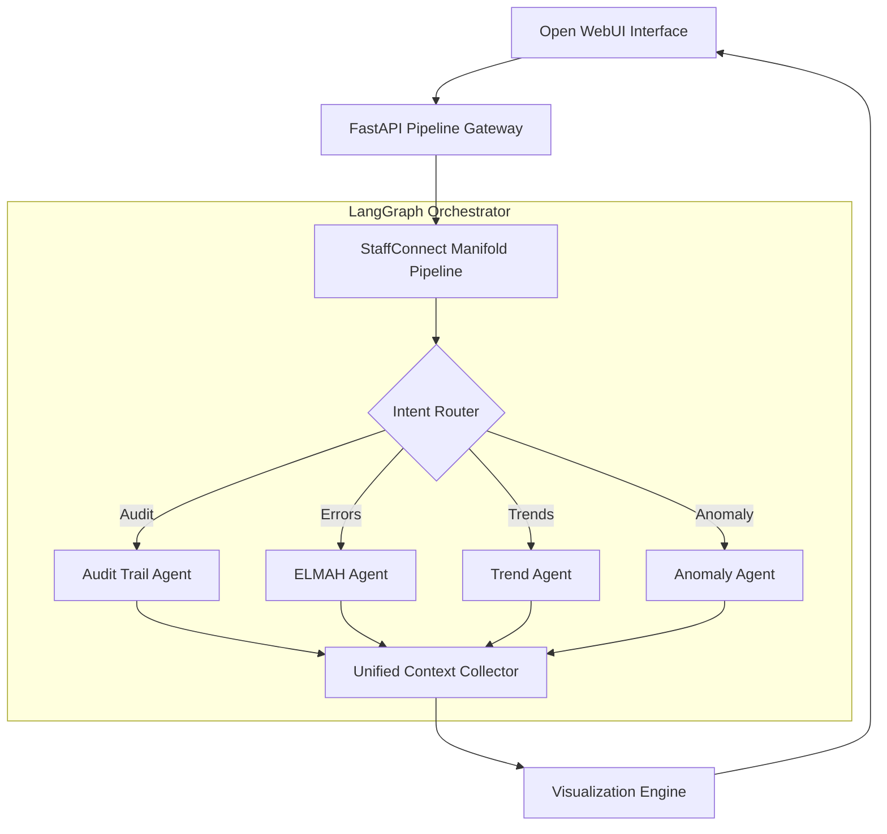

# StaffConnect: Multi-Agent SQL Analytics Pipeline (Open WebUI + LangGraph)

A professional-grade, agentic blueprint for enterprise-level **Text-to-SQL** analytics, built on the **Open WebUI Pipelines** framework. This system uses **LangGraph** to orchestrate specialized LLM agents that generate safe SQL, query an Oracle database, and return structured responses with visualizations.

> **Architecture Overview**
- **Host Framework**: [Open WebUI Pipelines](https://github.com/open-webui/pipelines)
- **Orchestration**: LangGraph (Router → Experts → Aggregation)
- **Pipeline Type**: Manifold (Exposes multiple model IDs like `gpt-4o-mini`, `o3-mini`)
- **Database**: Oracle (via SQLAlchemy/cx_Oracle)

---

## Table of Contents
- [Key Concepts](#key-concepts)
- [High-Level Architecture](#high-level-architecture)
- [Repository Layout](#repository-layout)
- [Open WebUI Integration](#open-webui-integration)
- [Agents](#agents)
- [State Model](#state-model)
- [SQL Safety & Guardrails](#sql-safety--guardrails)
- [Configuration (Valves)](#configuration-valves)
- [Local Setup](#local-setup)
- [Running the App](#running-the-app)
- [Testing](#testing)
- [License](#license)

---

## Key Concepts

### Open WebUI Manifold Pipeline
This project is implemented as a **Manifold Pipeline**. Unlike a standard pipe, a manifold allows a single backend script to register multiple models in the Open WebUI interface. In this case, it exposes different LLM "brains" for the same SQL analytics engine.

### Router-Expert Pattern
The system uses a **Router** to classify user intent and dispatch the query to one specialized **Expert Agent**:
- **Audit Trail**: Activity investigation and logs.
- **ELMAH**: Error frequency and failure analysis.
- **Trend**: Time-series and KPI analytics.
- **Anomaly**: Outlier detection and rare spikes.

---

## High-Level Architecture



---

## Repository Layout
```text
pipelines/
  staffconnect_chat.py    # Main Open WebUI Pipeline entry point
  staffconnect_chat_files/# Agent logic, chains, and LangGraph definitions
  common_files/           # Modularized utilities (SQL, Viz, LLM, Logging)
utils/pipelines/          # Framework-level helpers (Auth, Misc, Stream)
main.py                   # FastAPI Gateway serving the pipelines
schemas.py                # Shared Pydantic models and AgentState
tests/                    # Pytest unit and integration tests
```

---

## Open WebUI Integration

### Valves (Configuration)
Configuration is handled via Open WebUI **Valves**. You can set these directly in the WebUI settings:
- `ORACLE_USER` / `ORACLE_PASSWORD`: DB Credentials.
- `ORACLE_SERVICE` / `ORACLE_HOST`: Oracle connection details.
- `OPENAI_API_KEY`: LLM access.
- `CHART_DIRECTORY`: Path where generated analytic plots are stored.

### Gateway Server
The `main.py` file at the root acts as a standalone FastAPI server that is **OpenAI-API compatible**. You can connect Open WebUI to this gateway to host your custom pipelines.

---

## SQL Safety & Guardrails
- **Read-only Protocol**: Strictly enforces `SELECT` statements.
- **Keywords Blocklist**: Prevents `DROP`, `TRUNCATE`, `ALTER`, etc.
- **Row Limits**: Implicitly appends `FETCH FIRST N ROWS ONLY` to all queries.
- **Repair Loop**: If the DB returns an error (e.g., `ORA-00904`), the error is fed back to the LLM for an automated SQL repair attempt.

---

## Local Setup

1. **Requirements**: Python 3.11+, Oracle Instant Client.
2. **Installation**:
   ```bash
   pip install -r requirements.txt
   ```
3. **Environment**:
   Copy `env.example` to `.env` for local testing outside the UI.

---

## Running the App

### Start the Pipeline Gateway
```bash
python main.py
```
By default, the gateway runs on `http://localhost:9099`. In Open WebUI, add this URL as an OpenAI connection with your `API_KEY`.

---

## Testing
Comprehensive testing for specialized utilities:
```bash
pytest tests/test_utils.py
```

---

## License
MIT. See `LICENSE`.
